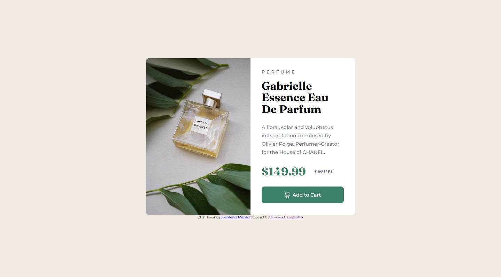

# Frontend Mentor - Product preview card component solution

This is a solution to the [Product preview card component challenge on Frontend Mentor](https://www.frontendmentor.io/challenges/product-preview-card-component-GO7UmttRfa). Frontend Mentor challenges help you improve your coding skills by building realistic projects.

### The challenge

Users should be able to:

- View the optimal layout depending on their device's screen size
- See hover and focus states for interactive elements

### Screenshot

### Links

- Live Site URL: [Add live site URL here](https://650aeddb108f1c548e75edf6--voluble-stardust-42096c.netlify.app/)

### Built with

- Semantic HTML5 markup
- CSS custom properties
- Flexbox
- Mobile-first workflow

### What I learned

When building a component, I improved my knowledge of how to create the component structure, apply visual styles, organize elements using flexbox, and make it responsive for different devices. Including and improving accessibility, good code practices, and troubleshooting. These fundamental skills are the foundation of development.

## Author

- Website - [Campiottocode's](https://app.netlify.com/teams/campiottocodes/sites)
- Frontend Mentor - [@Campiottocodes](https://www.frontendmentor.io/profile/Campiottocodes)
- LinkedIn - [Vinicius Campiotto](https://www.linkedin.com/in/vinicius-campiotto-421233250/)
